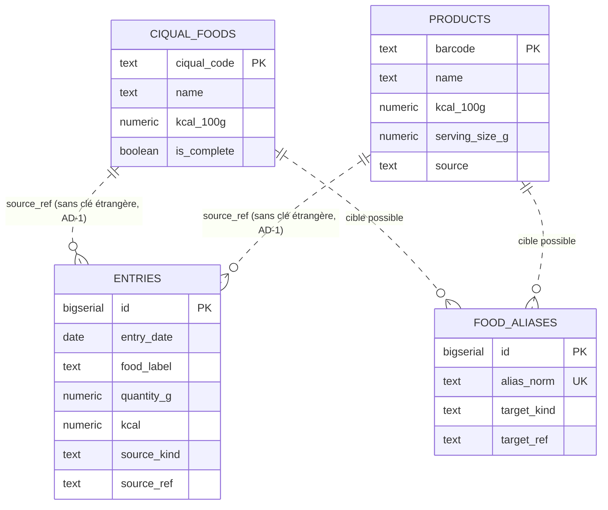
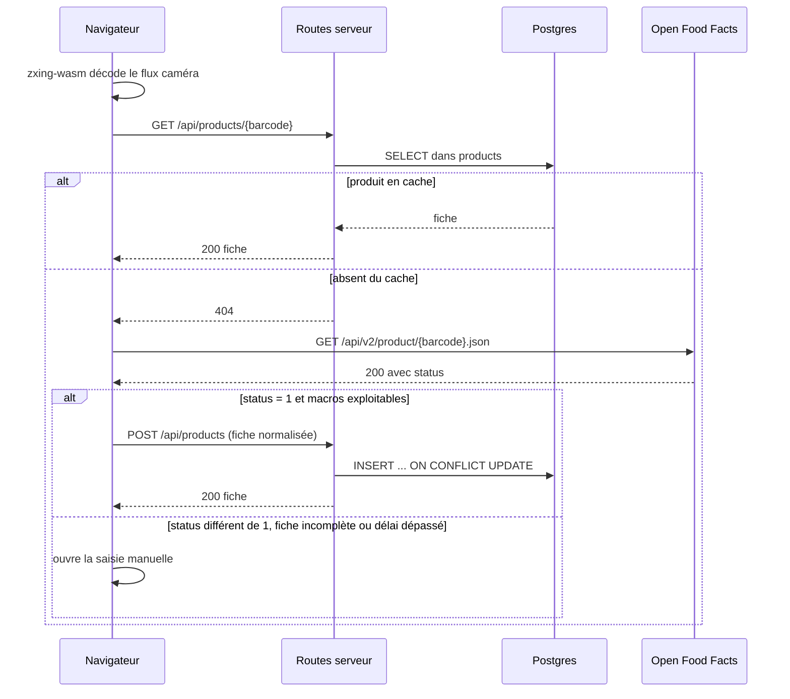

# Architecture Spine — NutriPerso

## Design Paradigm

Architecture en couches, avec un noyau de domaine qui ignore tout du transport.

| Couche | Répertoire | Dépend de |
|---|---|---|
| Présentation | `src/app/**` | `src/server`, `src/lib` |
| Routes serveur | `src/app/api/**` | `src/server` |
| Services de domaine | `src/server/services/**` | `src/server/db`, `src/server/clients` |
| Accès données | `src/server/db/**` | Drizzle uniquement |
| Clients externes | `src/server/clients/**` | SDK tiers uniquement |
| Client navigateur | `src/lib/client/**` | Rien du serveur |
| Types partagés | `src/lib/types.ts` | Rien |

La règle de dépendance est descendante et sans exception. Un composant de présentation n'importe jamais Drizzle. Un service n'importe jamais un objet de requête HTTP.

```mermaid
graph TD
  A["src/app — pages et composants"] --> B["src/server/services"]
  C["src/app/api — routes serveur"] --> B
  A --> D["src/lib/client — scanner, appels OFF, redim. image"]
  B --> E["src/server/db — schéma et requêtes Drizzle"]
  B --> F["src/server/clients — Mistral"]
  A --> G["src/lib/types — types partagés"]
  B --> G
  D --> G
  E --> H[("Postgres / Neon")]
  D --> I["Open Food Facts"]
  F --> J["API Mistral"]
```



## Invariants & Rules

### AD-1 — Les macros d'une entrée sont figées à l'écriture

- **Binds :** FR-10, FR-21, SM-4
- **Prevents :** Un affichage de journal qui joint `entries` à `products` ou `ciqual_foods` pour recalculer des valeurs, et voit donc l'historique bouger quand une fiche source est corrigée.
- **Rule :** La table `entries` porte ses propres colonnes `kcal`, `protein_g`, `carbs_g`, `fat_g`, déjà multipliées par la quantité, plus une copie de la désignation dans `food_label`. Toute lecture de journal se fait sur `entries` seule. Aucune requête d'affichage ni d'agrégation ne joint `entries` à une table de référence. Le lien vers la source (`source_kind`, `source_ref`) existe pour le diagnostic et les raccourcis de quantité, jamais pour l'affichage des valeurs.

### AD-2 — Open Food Facts est appelé depuis le navigateur, jamais depuis le serveur

- **Binds :** FR-13
- **Prevents :** Une route serveur `/api/off/[barcode]` qui ferait passer tous les appels derrière l'IP de la fonction Vercel, et consommerait le quota de 15 requêtes par minute pour l'ensemble des utilisateurs de cette IP partagée.
- **Rule :** Le seul appel à `world.openfoodfacts.org` part de `src/lib/client/openfoodfacts.ts`, exécuté dans le navigateur. Aucun fichier sous `src/server` ni `src/app/api` ne mentionne ce domaine. L'appel porte un en-tête `User-Agent` identifiant l'application et restreint les champs demandés via le paramètre `fields`.
- **Exception, 18/09/2026 :** la recherche par nom vise `search.openfoodfacts.org`, un autre service, qui ne sert aucun en-tête CORS — son préambule répond « Disallowed CORS origin » et sa réponse ne porte pas d'`Access-Control-Allow-Origin`. Appelée depuis le navigateur elle ne rend donc jamais rien, en silence. Elle passe par `src/app/api/off/search`, qui mémorise une heure. Le quota de quinze requêtes par minute que cette décision protège est celui de l'API produit, pas celui de ce moteur : le code-barres, lui, reste appelé depuis le navigateur.

### AD-3 — Le succès d'un appel Open Food Facts se lit dans le corps, pas dans le code HTTP

- **Binds :** FR-13, FR-15
- **Prevents :** Un `if (response.ok)` qui traite un produit introuvable comme un succès, l'API répondant HTTP 200 en toutes circonstances.
- **Rule :** La fonction de récupération renvoie un résultat discriminé : `{ kind: 'found', product }`, `{ kind: 'not_found' }`, `{ kind: 'incomplete', partial }` ou `{ kind: 'error', reason }`. Le cas `found` exige `status === 1` **et** la présence exploitable de l'énergie et des trois macros. Le code HTTP ne sert qu'à détecter une panne de transport.

### AD-4 — La clé d'API Mistral ne franchit jamais la frontière serveur

- **Binds :** FR-17, NFR sécurité
- **Prevents :** Une variable `NEXT_PUBLIC_MISTRAL_API_KEY`, ou un appel au SDK Mistral depuis un composant client, qui exfiltrerait la clé dans le bundle.
- **Rule :** Le SDK Mistral n'est importé que dans `src/server/clients/mistral.ts`. La variable `MISTRAL_API_KEY` n'a pas de préfixe `NEXT_PUBLIC_`. Le navigateur envoie l'image à `POST /api/recognize` et reçoit un tableau de chaînes. Aucune erreur brute du SDK n'est propagée dans la réponse.

### AD-5 — Postgres est la seule source de vérité

- **Binds :** FR-4, FR-23, contraintes iOS
- **Prevents :** Un stockage de journal en `localStorage` ou IndexedDB traité comme fiable, alors qu'iOS le purge après sept jours sans ouverture.
- **Rule :** Aucune donnée métier n'est écrite dans un stockage navigateur. Le service worker ne met en cache que les ressources statiques de la coquille applicative. Toute réponse de `/api/**` porte `Cache-Control: no-store`. Hors ligne, l'application affiche un écran de repli plutôt qu'un journal potentiellement périmé.

### AD-6 — La recherche textuelle passe par un index trigramme

- **Binds :** FR-7, FR-18, NFR performance
- **Prevents :** Un `ILIKE '%terme%'` qui balaye 3200 lignes CIQUAL à chaque frappe et rend l'index inutile.
- **Rule :** Les extensions `pg_trgm` et `unaccent` sont activées par migration. Les colonnes de nom portent un index GIN sur `unaccent(lower(nom)) gin_trgm_ops`. Toute requête de recherche utilise l'opérateur `%` ou la fonction `similarity()` sur l'expression exactement identique à celle de l'index, faute de quoi l'index n'est pas retenu par le planificateur. `unaccent` étant marquée `STABLE` et non `IMMUTABLE`, une fonction enveloppe `IMMUTABLE` est créée dans la même migration pour rendre l'index possible.

### AD-7 — Une seule session, pas d'utilisateur

- **Binds :** FR-1, FR-2, FR-3
- **Prevents :** Une table `users`, une colonne `user_id` sur `entries`, ou toute autre amorce de multi-tenant qui alourdirait le modèle sans jamais servir.
- **Rule :** Aucune table ni colonne ne porte de notion de propriétaire. L'authentification est un cookie signé dont la charge utile ne contient qu'un horodatage d'émission. La vérification du mot de passe utilise une comparaison en temps constant. Le contrôle de session est centralisé dans `src/middleware.ts` pour les navigations, et dans un garde partagé pour les routes serveur.

### AD-8 — Les valeurs nutritionnelles de référence sont stockées pour 100 g

- **Binds :** FR-6, FR-10, FR-15
- **Prevents :** Deux tables de référence exprimant leurs valeurs dans des bases différentes, et un calcul de prorata qui se trompe selon la source.
- **Rule :** `ciqual_foods` et `products` expriment tous deux `kcal_100g`, `protein_100g`, `carbs_100g`, `fat_100g`. La normalisation depuis Open Food Facts, dont les champs sont déjà par 100 g, se fait à l'écriture dans le cache et jamais à la lecture. Le calcul d'une entrée est unique et vit dans un seul module de domaine.

### AD-9 — Les valeurs nutritionnelles sont stockées en numérique exact

- **Binds :** AD-1, FR-6, FR-10
- **Prevents :** Des totaux de journal qui dérivent au fil des additions à cause de l'arithmétique flottante, et un contre-exemple à SM-4 qui exige une identité à l'octet près.
- **Rule :** Toutes les colonnes nutritionnelles sont de type `numeric(10,3)`. Les sommes sont calculées par Postgres. L'arrondi n'a lieu qu'à l'affichage. Aucun calcul nutritionnel n'est effectué en JavaScript sur des nombres flottants avant écriture.

### AD-10 — Une seule ligne de commande donne le mode de rendu

- **Binds :** FR-4, FR-11, FR-17
- **Prevents :** Un `"use client"` posé en haut d'une page entière parce qu'un bouton en avait besoin, entraînant Drizzle ou la clé Mistral vers le bundle client.
- **Rule :** Les pages sont des composants serveur par défaut. `"use client"` n'apparaît que sur les composants qui utilisent un état, un effet ou une API navigateur : scanner, champ de recherche, pavé de quantité, prise de vue. Un composant client n'importe jamais un module de `src/server`.

### AD-11 — La date du jour est calculée dans le fuseau Europe/Paris

- **Binds :** FR-4, FR-20
- **Prevents :** Un journal qui bascule au jour suivant à 2 h du matin heure locale parce que la fonction serveur tourne en UTC.
- **Rule :** La colonne `entries.entry_date` est de type `date`. Sa valeur est déterminée par un utilitaire unique de `src/lib/date.ts` qui applique explicitement le fuseau `Europe/Paris`. Aucun appel à `new Date().toISOString().slice(0,10)` n'est admis pour déterminer une date de journal.

### AD-12 — Les échecs des chemins d'ajout sont modélisés, pas exceptionnels

- **Binds :** FR-11, FR-13, FR-15, FR-17, FR-18
- **Prevents :** Des `try/catch` qui affichent un message générique et perdent l'information dont l'interface a besoin pour proposer le bon repli.
- **Rule :** Chaque opération faillible d'un chemin d'ajout renvoie un type discriminé plutôt que de lever. L'interface aiguille sur la variante : produit introuvable vers la saisie manuelle, permission refusée vers la recherche, reconnaissance indisponible vers la recherche. Aucun message d'erreur affiché ne provient de la sérialisation d'une exception.

## Consistency Conventions

| Concern | Convention |
| --- | --- |
| Nommage des tables et colonnes | `snake_case` en base, pluriel pour les tables. Le modèle Drizzle expose du `camelCase` en TypeScript. |
| Nommage des fichiers | `kebab-case.ts`. Composants React en `PascalCase.tsx`. |
| Identifiants | Clés primaires en `bigserial`, sauf `products` dont la clé est le `barcode` en `text`, et `ciqual_foods` dont la clé est le `ciqual_code` en `text`. |
| Dates | `date` pour une date de journal, `timestamptz` pour un horodatage technique. Jamais de date en `text`. |
| Valeurs nutritionnelles | `numeric(10,3)`, toujours pour 100 g dans les tables de référence, toujours pour la quantité consommée dans `entries`. |
| Forme des erreurs de route | `{ error: { code: string, message: string } }` avec un code de la liste fermée du module d'erreurs. Jamais de message d'exception brut. |
| Codes HTTP | 200 succès, 400 entrée invalide, 401 sans session, 413 image trop lourde, 422 réponse du modèle hors format, 502 service externe indisponible. |
| Validation d'entrée | Zod à la frontière de chaque route serveur. Le corps est analysé, jamais utilisé tel quel. |
| Mutation d'état | Les écritures passent par des Server Actions pour les formulaires, par des routes serveur pour ce qui vient du navigateur en JavaScript. Jamais les deux pour une même opération. |
| Journalisation | `console.error` côté serveur, avec un contexte structuré. Aucun secret, aucun mot de passe, aucune image dans les journaux. |
| Configuration | Une seule lecture de `process.env`, dans `src/server/env.ts`, validée par Zod au démarrage. Aucun `process.env` ailleurs. |
| Migrations | Générées par `drizzle-kit generate`, versionnées dans `drizzle/`. Aucune modification manuelle d'une migration déjà appliquée. |

## Stack

Versions vérifiées auprès du registre npm le 2026-09-10.

| Name | Version |
| --- | --- |
| Next.js | 15.5.25 |
| React | 19.3.0 |
| TypeScript | 5.9.3 |
| Tailwind CSS | 4.3.3 |
| @tailwindcss/postcss | 4.3.3 |
| daisyUI | 5.7.34 |
| Drizzle ORM | 0.45.2 |
| drizzle-kit | 0.31.10 |
| @neondatabase/serverless | 1.1.0 |
| zxing-wasm | 3.1.3 |
| @mistralai/mistralai | 2.7.0 |
| Zod | 4.6.1 |
| @serwist/next | 9.5.12 |
| tsx | 4.23.13 |
| csv-parse | 7.0.2 |
| ESLint | 9 (via eslint-config-next 15.5.25) |
| Node | 22 LTS |

Trois écarts méritent d'être justifiés explicitement.

**Next.js 15 et non 16.** La version 16.3.4 est disponible, mais le cadrage impose la ligne 15. La version retenue est la plus récente de cette ligne. Ce choix se révise, il ne se subit pas.

**TypeScript 5.9.3 et non 7.0.2.** La ligne 7 est publiée mais représente un changement de compilateur majeur, dont la compatibilité avec la chaîne Next 15 n'est pas établie. La contrainte de la Definition of Done, une compilation sans le moindre avertissement, rend ce pari inacceptable pour un projet dont le build conditionne chaque commit.

**@serwist/next et non next-pwa.** Le cadrage n'impose aucune bibliothèque de service worker. `next-pwa` n'a plus été publié depuis août 2022 et ne connaît pas l'App Router. Serwist en est le successeur maintenu.

Le modèle de vision est configuré par la variable `MISTRAL_MODEL`, valeur par défaut `pixtral-12b-2409`. Aucune vérification de la disponibilité de ce modèle sur le niveau gratuit n'a pu être faite sans clé d'API. C'est un point à confirmer avant de livrer la reconnaissance photo, tracé en question ouverte 4 du PRD.

## Structural Seed

### Modèle de données



Le lien entre `entries` et ses sources est délibérément dépourvu de clé étrangère. Une contrainte référentielle ferait dépendre l'existence d'une entrée de celle de sa fiche source, ce qui contredit AD-1. `source_kind` vaut `ciqual` ou `product`, et `source_ref` porte le code CIQUAL ou le code-barres correspondant.

### Parcours d'un scan



### Arborescence

```text
nutri-perso/
  drizzle/                      # migrations générées, versionnées
  scripts/
    import-ciqual.ts            # import CSV ANSES, idempotent
  data/
    ciqual.csv                  # table ANSES (voir question ouverte 2 du PRD)
  src/
    middleware.ts               # garde de session pour les navigations
    app/
      layout.tsx
      page.tsx                  # journal du jour
      unlock/page.tsx
      add/
        page.tsx                # feuille de choix de mode
        scan/page.tsx
        search/page.tsx
        photo/page.tsx
        manual/page.tsx         # saisie d'un produit inconnu
      history/
        page.tsx
        [date]/page.tsx
      settings/page.tsx
      api/
        session/route.ts        # POST déverrouille, DELETE verrouille
        products/route.ts       # POST met en cache
        products/[barcode]/route.ts
        search/route.ts
        entries/route.ts
        entries/[id]/route.ts
        recognize/route.ts      # appel Mistral, serveur uniquement
    server/
      env.ts                    # unique lecture de process.env, validée
      auth.ts                   # cookie signé, comparaison en temps constant
      guard.ts                  # garde partagé des routes serveur
      errors.ts                 # codes d'erreur fermés
      db/
        client.ts
        schema.ts
        queries/                # une fonction par requête, testable seule
      services/
        entries.ts              # calcul et figeage des macros (AD-1, AD-8)
        search.ts               # recherche trigramme (AD-6)
        products.ts
        aliases.ts
      clients/
        mistral.ts              # seul importateur du SDK (AD-4)
    lib/
      types.ts                  # types partagés client et serveur
      date.ts                   # dates en Europe/Paris (AD-11)
      nutrition.ts              # prorata, pur, sans dépendance
      client/
        scanner.ts              # zxing-wasm, gestion du flux caméra
        openfoodfacts.ts        # seul appelant d'OFF (AD-2, AD-3)
        image.ts                # redimensionnement avant envoi
    components/
      ...
  public/
    manifest.json
    icons/
```

## Capability → Architecture Map

| Capability / Area | Lives in | Governed by |
| --- | --- | --- |
| Accès et session (FR-1 à FR-3) | `src/middleware.ts`, `src/server/auth.ts`, `src/app/api/session` | AD-7 |
| Journal du jour (FR-4, FR-5) | `src/app/page.tsx`, `src/server/services/entries.ts` | AD-1, AD-9, AD-11 |
| Import CIQUAL (FR-6) | `scripts/import-ciqual.ts`, `drizzle/` | AD-8, AD-9 |
| Recherche textuelle (FR-7) | `src/server/services/search.ts`, `src/app/api/search` | AD-6 |
| Ajout d'une entrée (FR-8 à FR-10) | `src/lib/nutrition.ts`, `src/server/services/entries.ts` | AD-1, AD-8, AD-9 |
| Scan de code-barres (FR-11, FR-16) | `src/lib/client/scanner.ts`, `src/app/add/scan` | AD-10, AD-12 |
| Résolution de code-barres (FR-12 à FR-15) | `src/lib/client/openfoodfacts.ts`, `src/app/api/products` | AD-2, AD-3, AD-8, AD-12 |
| Reconnaissance photo (FR-17 à FR-19) | `src/server/clients/mistral.ts`, `src/app/api/recognize`, `src/server/services/aliases.ts` | AD-4, AD-6, AD-12 |
| Historique (FR-20, FR-21) | `src/app/history` | AD-1, AD-11 |
| Socle PWA (FR-22 à FR-24) | `public/manifest.json`, configuration Serwist, `src/app/settings` | AD-5 |

## Deferred

**Le seuil de similarité trigramme.** Sa valeur ne peut pas être fixée avant que la table CIQUAL soit importée et testée sur des noms réels. La décision est repoussée à la story de recherche, avec pour contrainte que la valeur soit une constante nommée dans `src/server/services/search.ts` et non un littéral disséminé.

**La stratégie de test.** Aucun cadre de test n'est imposé par le cadrage, et la Definition of Done ne repose que sur la compilation et l'analyse statique. Les fonctions pures de `src/lib/nutrition.ts` et de `src/lib/date.ts` sont écrites pour être testables sans infrastructure, ce qui laisse la porte ouverte sans imposer d'outillage maintenant.

**Le versionnement du CSV CIQUAL.** Question ouverte 2 du PRD. Le script d'import accepte un chemin en argument, ce qui rend la décision réversible sans changement de code.

**La journalisation applicative et la supervision.** Un projet mono-utilisateur sur le niveau gratuit de Vercel n'a rien à superviser au-delà des journaux de la plateforme.

**Le type de repas sur les entrées.** Question ouverte 1 du PRD. La table `entries` est conçue pour accueillir une colonne supplémentaire sans migration destructrice.
